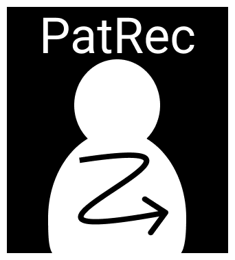

<!-- PROJECT SHIELDS -->
<!--
*** I'm using markdown "reference style" links for readability.
*** Reference links are enclosed in brackets [ ] instead of parentheses ( ).
*** See the bottom of this document for the declaration of the reference variables
*** for contributors-url, forks-url, etc. This is an optional, concise syntax you may use.
*** https://www.markdownguide.org/basic-syntax/#reference-style-links
-->


<!-- PROJECT LOGO -->
<br />
<p align="left">
  <a href="https://github.com/JessicaV97/PatRec.git">
    
  </a>
</p>


<!-- TABLE OF CONTENTS -->
<details open="open">
  <summary>Table of Contents</summary>
  <ol>
    <li>
      <a href="#about-the-project">About The Project</a>
      <ul>
        <li><a href="#built-with">Built With</a></li>
      </ul>
    </li>
    <li>
      <a href="#getting-started">Getting Started</a>
      <ul>
        <li><a href="#installation">Installation</a></li>
      </ul>
    </li>
    <li><a href="#license">License</a></li>
    <li><a href="#contact">Contact</a></li>
    <li><a href="#acknowledgements">Acknowledgements</a></li>
  </ol>
</details>


<!-- ABOUT THE PROJECT -->
## About The Project

<!-- [![Product Name Screen Shot][product-screenshot]](https://example.com) -->
This project is an internship assignment which contributes to the suitceyes project. 
The aim is to provide people with deafblindness a tool that helps them learn or improve recognition of social haptic communication patterns emulated by vibration motors by means of gamified learning. Still, the tool can also be used without deafblindess. 
PatRec, is a software application available for Android OS and needs to be combined with hardware, a chairable, in order to be useful.
The chairable is a wearable put over the backrest of a chair with 9 vibration motors positioned grid-wise (3x3), with 1,5 times the distance vertically between the motors compared to horizontally. 

### Built With

PatRec was built with: 
* [Figma](https://www.figma.com/downloads/)
* [Unity](https://unity.com/)


<!-- GETTING STARTED -->
## Getting Started

To get a local copy up and running follow these simple example steps.


### Installation

1. Clone the repository
   ```sh
   git clone https://github.com/JessicaV97/PatRec.git
   ```


<!-- CONTRIBUTING -->
## Contributing

This project is open source. Any contributions you make are **greatly appreciated**.

1. Fork the Project
2. Create your Feature Branch (`git checkout -b feature/NewFeature`)
3. Commit your Changes (`git commit -m 'Add some features'`)
4. Push to the Branch (`git push origin feature/NewFeature`)
5. Open a Pull Request


<!-- LICENSE -->
## License

Distributed under the MIT License. See `App\LICENSE` for more information.


<!-- CONTACT -->
## Contact

Jessica Vuijk - [LinkedIn](www.linkedin.com/in/jessica-vuijk) - jessica-vuijk@outlook.com

Project Link: [https://github.com/JessicaV97/PatRec.git](https://github.com/JessicaV97/PatRec.git)


<!-- ACKNOWLEDGEMENTS -->
## Acknowledgements
* [SUITCEYES](https://suitceyes.eu/)

